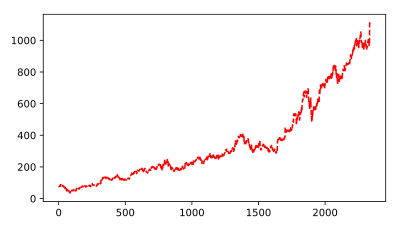
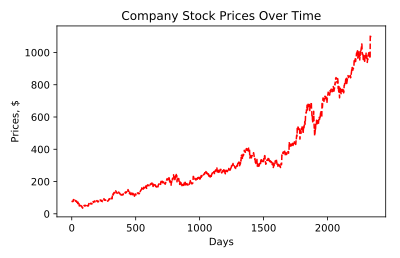
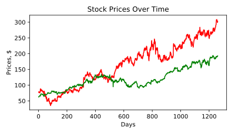
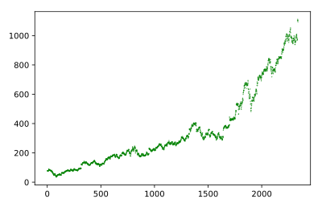
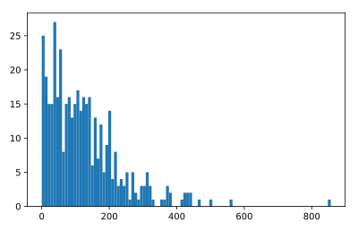
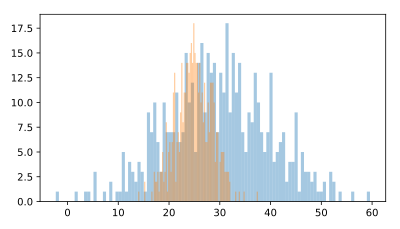
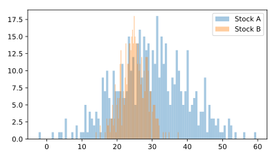
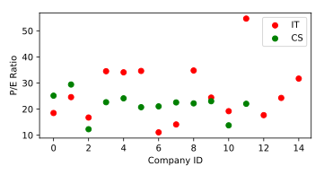
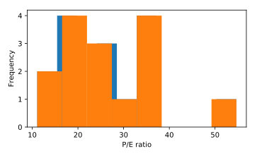

# Finance 
### Variables in python
#### Variable names
- Names can be upper or lowser case letters, digots and underscores.
- Varibles can't statrt with a digit
- Some variable names are reserved in pyton.(e.g; class,type) and should be avoided.

#### Variable example
```python 
day_2=5
```

#### Using common way to evaluate stocks

```python 
Price to earning rasio= market Price/ Earning per share
```


Price to earning rasio is a commen way to evaluate stocks. It shows how much investors are willing to pay per dollar earning for stocks.

```python 
price= 200
earning =5
pe_rasio= price/ earning
print(pe_rasio)
```
Python examples
Find the total of revenue_1, revenue_2  revenue_3
```python 
# Print the total revenue
total = revenue_1 + revenue_2 + revenue_3
print(total)

# Print the average revenue
average = total/3
print(average)
```

#### Creating variables
Variables in Python hold a value that may consist of varying data types. Variable names can contain letters, underscores, and numbers.
```python 
revenue_1 = 229.23
print(revenue_1)
```
Output:
```
229.23
```

#### Determining types
Python has a built-in command type() that can determine the type of a variable or literal value.
```python 
# Type of company_1
print(type(company_1))

# Type of year_1
print(type(year_1))

# Type of revenue_1
print(type(revenue_1))
```
Output:
```
<class 'str'>
<class 'int'>
<class 'float'>
```
#### Booleans in Python
Booleans are used to represent True or False statements in Python. Boolean comparisons include:

```python 

>	greater than
>=	greater than or equal
<	less than
<=	less than or equal
==	equal
!=	does not equal
```
E.g: The revenue of company 1 and company 2 are provided as revenue_1 and revenue_2, respectively. Using a comparison operator, determine if revenue_1 is greater than revenue_2.

```python 
# Compare revenue_1 and revenue_2
print(revenue_1 > revenue_2)
```
Output:
```
True
```

#### Combining data types
Different types of data types have different properties. For example, strings and floats cannot be mathematically combined. To convert a variable x to an integer, you can use the command int(x). Similarly, to convert a variable y to a string, you can use the command str(y).

E.g:
- Convert the data type of variables year_1, and revenue_1 to string.
- Use these new variables to create and print the following sentence: "The revenue of Apple in 2017 was $229.23 billion."

```python 
# Update data types
year_1_str = str(year_1)
revenue_1_str = str(revenue_1)
# Create a complete sentence combining only the string data types
sentence = 'The revenue of ' + company_1 + ' in ' + year_1_str + ' was $' + revenue_1_str + ' billion.'

# Print sentence
print(sentence)
```
Output
```
The revenue of Apple in 2017 was $229.23 billion.
```

### Lists in Python

#### Creating lists in Python
A list in Python can contain any number of elements. You generally create a list using square brackets. For example, to create a list of integers, you can use the following command:
```python 
x = [1, 2, 3]
```
E.g:
- Create a list named names containing the strings 'Apple Inc', 'Coca-Cola', and 'Walmart', in that order.
Print names.
- Create a list named prices containing the price of each stock, $159.54, $37.13, and $71.17, in that order.
```python 
# Create and print list names
names = [ 'Apple Inc', 'Coca-Cola', 'Walmart']
print(names[0:])

# Create and print list prices
prices = [159.54, 37.13, 71.17]
print(prices[0:])
```
```
['Apple Inc', 'Coca-Cola', 'Walmart']
[159.54, 37.13, 71.17]
```
#### Indexing list items
Each item in a list has an assigned indexed value. Remember that Python is a zero indexed language, and the first element in a list is stored at index zero. In this exercise, you will practice subsetting single elements from a list.

Q&A
- Print the first element in names.
- Print the second element in names.
- Using a negative index, print the last element in prices.
```python 
# Print the first item in names
print(names)

# Print the second item in names
print(names[1])

# Print the last element in prices
print(prices[-1])
```
```
['Apple Inc', 'Coca-Cola', 'Walmart']
Coca-Cola
71.17
```
#### Slicing multiple list elements

Slicing operations on a list are used to subset multiple elements from a list. The syntax for list slicing is as follows:
```python 
list[start:end]
```
Remember, this syntax indicates subsetting all elements from the start and up to but not including the end element.

Also, you can use extended slicing to efficiently select multiple elements from a list. For example, the following command returns all elements from the list except the first (at index 0):

```python 
x = [1, 2, 3, 4, 5]
x[1:]

[2, 3, 4, 5]
```
Similarly, the following command returns all elements from the list except the last two:
```python 
x[:-2]

[1, 2, 3]
```

Q&A:
Use list slicing to subset the last two elements from names.
```python 
prices = [159.54, 37.13, 71.17]

# Use extended slicing on the list prices
prices_subset = prices[1:]
print(prices_subset)
```

```
[37.13, 71.17]
```

### Lists in Lists

#### Stock up a nested list
Lists can also contain other lists. In the example shown below, x is a nested list consisting of three lists:
```python 
x = [[1, 2, 3], [4, 5, 6], [7, 8, 9]]
```
You can use indexing to subset lists within a nested list. To extract the first list within x, you can use the following command:
```python 
x[0]

[1, 2, 3]
```
Q&A
names = ['Apple Inc', 'Coca-Cola', 'Walmart']
prices = [159.54, 37.13, 71.17]

- Create a list named stocks consisting of the lists names and prices, in that order.
- Use list indexing to subset the list prices from stocks (Remember that prices is the second element in stocks).

```python 
# Create and print the nested list stocks
stocks = [['Apple Inc', 'Coca-Cola', 'Walmart'], [159.54, 37.13, 71.17]]
print(stocks)

# Use list indexing to obtain the list of prices
print(stocks[1])
```

### Subset a nested list
You can also extract an element from the list you extracted. To do this, you use two indices. The first index is the position of the list, and the second index is the position of the element within the list.

For example, if you want to extract 7 from x, you can use the following command:
```python 
x = [[1, 2, 3], [4, 5, 6], [7, 8, 9]]
x[2][0]

7
```
Here the first index 2 refers to the third list in x and the second index 0 refers to the first element of the third list in x.

Q&A:
stocks = [['Apple Inc', 'Coca-Cola', 'Walmart'], [159.54, 37.13, 71.17]]
1. From the nested list stocks, subset 'Coca-Cola'.
```python 
stocks[0][1]
```
2. From the nested list stocks, subset the price for walmart stock.
```python 
stocks=[1][2]
```

### List methods and functions

#### Exploring list methods and functions
Lists methods and functions are useful for analyses. Functions take objects as inputs or are "passed" an object. Methods, in contrast, act on objects. For lists, useful functions include max() and min(), which identify the maximum or minimum value in a list. A useful list method is .sort() which sorts the elements in a list.

##### Methods Vs. Functions
Methods
- All methods are functions
- List methods are a subset of a built-in functions in python.
- Used on an object
E.g: Price.sort()

Functions
- Not all functions are methods
E.g: type(prices)

Q&A:
1. Using the method .sort(), sort and print the prices in the list prices.
```python 
 Print the sorted list prices
prices = [159.54, 37.13, 71.17]
prices.sort();
print(prices)
```
2. Identify the maximum price in prices using the function max().
```python 
prices = [159.54, 37.13, 71.17]
price_max = max(prices)
print(price_max)
```
```
159.54
```
#### Using list methods to add data
You can use the .append() and .extend() methods to add elements to a list.
##### append()
The .append() method increases the length of the list by one, so if you want to add only one element to the list, you can use this method.

```python 
x = [1, 2, 3]
x.append(4)
x

[1, 2, 3, 4]
```
##### extend()
The .extend() method increases the length of the list by the number of elements that are provided to the method, so if you want to add multiple elements to the list, you can use this method.
```python 
x = [1, 2, 3]
x.extend([4,5,6])
x
[1,2,3,4,5]
```
Q&A
1. Add a single element, 'Amazon.com', to the names.
names = ['Apple Inc', 'Coca-Cola', 'Walmart']
```python 
# Append a name to the list names
names.append('Amazon.com')
print(names)
```
2. Add the list more_elements which consists of two elements to names.

```python 
# Extend list names
more_elements = ['DowDuPont', 'Alphabet Inc']
names.extend(more_elements)
print(names)
```
#### Finding stock with maximum price
Another useful list method is .index(), which returns the index of the element specified. For example, to get the index of 2 in x, you would use:
```python 
x = [1, 2, 3, 4]
x.index(2)

1
```
You can then use this result to subset another list, as you will do in this exercise.

Q&A:
1. Identify the index of max_price in the list prices.
2. Use this index on the names list to identify the company with maximum stock price.

```python 
# Do not modify this
max_price = max(prices)

# Identify index of max price
max_index = prices.index(max_price)

# Identify the name of the company with max price
max_stock_name = names[max_index]

# Fill in the blanks 
print('The largest stock price is associated with ' + max_stock_name + ' and is $' + str(max_price) + '.')
```
### Arrays
#### Installing packages
```python 
pip3 install package_name_herepip3 install numpy
```
```python 
pip3 install numpy
```
#### Numpy arrays
##### NumPy and Arrays
```python 
import numpy
my_array = numpy.array([0, 1, 2, 3, 4])
print(my_array)
[0, 1, 2, 3, 4]
print(type(my_array))
<class 'numpy.ndarray'>

```
##### Using an alias
```python 
import numpy as np
my_array = np.array([0, 1, 2, 3, 4])
print(my_array)

[0, 1, 2, 3, 4]

```
##### Why use an array for financial analysis?
Arrays can handle very large datasets;
- Computationally-memory efficient
- Faster calculations and analysis than lists
- Diverse functionality (many functions in Python packages)

#### What's the difference?
##### NUMPY ARRAYS


##### Create an array
You can use the NumPy package to create arrays. NumPy arrays are optimized for numerical analyses and contain only a single data type. To convert a list to an array, you can use the array() function from NumPy.
```python 
mport numpy as np

a_list = [1, 2, 3, 4]
a_list

[1, 2, 3, 4]

an_array = np.array(a_list)
an_array

array([1, 2, 3, 4])
```
Q&A:
1. Import numpy using the alias np.
2. Create prices_array and earnings_array arrays from the lists prices and earnings, respectively.
```python 
# Import numpy as np
import numpy as np

# Lists
prices = [170.12, 93.29, 55.28, 145.30, 171.81, 59.50, 100.50]
earnings = [9.2, 5.31, 2.41, 5.91, 15.42, 2.51, 6.79]

# NumPy arrays
prices_array = np.array(prices)
earnings_array = np.array(earnings)
```
```
[170.12  93.29  55.28 145.3  171.81  59.5  100.5 ]
[ 9.2   5.31  2.41  5.91 15.42  2.51  6.79]
```
##### Elementwise operations on arrays
Arrays allow for efficient numerical manipulation of its elements. Let's explore element-wise mathematical operations by calculating price to earnings ratio using two arrays, prices_array and earnings_array from the previous exercise.

This price to earnings ratio, or PE ratio, is a financial indicator of the dollar amount an investor can expect to invest in a company in order to receive one dollar of that company’s earnings.

Q&A:
1. import numpy as np.
2. Create pe_array by dividing prices_array by earnings_array.

```python 
# Import numpy as np
import numpy as np

# Create PE ratio array
pe_array = prices_array/ earnings_array

# Print pe_array
print(pe_array)

```

##### Subsetting elements from an array

Subsetting arrays is similar to subsetting lists.

Q&A:
1. Subset the first three elements from prices_array.

```python 
# Subset the first three elements
prices_subset_1 = prices_array[0:3]
print(prices_subset_1)
```

2. Subset the last three elements from the prices_array using negative index slicing.

```python 
# Subset last three elements 
prices_subset_2 = prices_array[-3:]
print(prices_subset_2)
```
3. Subset every third element from the prices_array using step slicing.

```python 
# Subset every third element
prices_subset_3 = prices_array[0:7:3]
print(prices_subset_3)
```
#### Two dimensional arrays

##### Creating a 2D array
Multi-dimensional arrays can be useful for several tasks. In finance, for example, a 2D array may be used to store the prices and earnings for various companies. 

Q&A:
1. Create a two dimensional array of prices and earnings (in that order) and assign it to stock_array.
2. Print the shape of stock_array.

```python 
# Create a 2D array of prices and earnings
stock_array = np.array([prices,earnings])
print(stock_array)

# Print the shape of stock_array
print(stock_array.shape)

# Print the size of stock_array
print(stock_array.size)
```

Q&A:
1. Transpose stock_array and assign the result to stock_array_transposed.
2. Print the size of stock_array_transposed.
Take Hint (-15 XP)

```python 

```

```
[[170.12   9.2 ]
 [ 93.29   5.31]
 [ 55.28   2.41]
 [145.3    5.91]
 [171.81  15.42]
 [ 59.5    2.51]
 [100.5    6.79]]
```

##### Subsetting 2D arrays
Subsetting 2D arrays is similar to subsetting nested lists. In a 2D array, the indexing or slicing must be specific to the dimension of the array:
```python 
array[row_index, column_index]
```
Q&A:
1. Extract the first column from stock_array_transposed and assign it to prices.

```python 
# Subset prices from stock_array_transposed
prices = stock_array_transposed[:,0]
print(prices)
```
```
[170.12  93.29  55.28 145.3  171.81  59.5  100.5 ]
```
2. Extract the second column from stock_array_transposed and assign it to earnings.

```python 
# Subset earnings from stock_array_transposed
earnings = stock_array_transposed[:,1]
print(earnings)
```
```
[ 9.2   5.31  2.41  5.91 15.42  2.51  6.79]
```
3. Subset the price and earning of the first company (row 0) from stock_array_transposed and assign it to company_1.

```python 
# Subset the price and earning for first company
company_1 = stock_array_transposed[0,]
print(company_1)
```
```
 [170.12   9.2 ]
```

#### Calculating array stats

Not only can you perform elementwise calculations on NumPy arrays, you can also calculate summary stats such as mean and standard deviation of arrays using functions from NumPy.

Q&A:
1. Calculate the mean of prices.

```python 
 # Calculate the mean 
prices_mean = np.mean(prices)
print(prices_mean)
```

```
113.6857142857143
```
2. Calculate the standard deviation of prices.
```python 
# Calculate the standard deviation 
prices_std = np.std(prices)
print(prices_std)
```

```
45.51277932221513
```
#### Generating a sequence of numbers
You may want to create an array of a range of numbers (e.g., 1 to 10) without having to type in every single number. The NumPy function arange() is an efficient way to create numeric arrays of a range of numbers. The arguments for arange() include the start, stop, and step interval as shown below:

np.arange(start, stop, step)
numpy is imported as np.

Q&A
1. Create an array company_ids containing the numbers 1 through 7 (inclusive).
2. Create an array company_ids_odd containing only the odd numbers from 1 through 7 (inclusive).

```python 
# Create and print company IDs
company_ids = np.arange(1, 8, 1)
print(company_ids)

# Use array slicing to select specific company IDs
company_ids_odd = np.arange(1,8, 2)
print(company_ids_odd)
```
```
[1 2 3 4 5 6 7]
[1 3 5 7]
```
#### Using arrays for analysis

##### Boolean arrays
Who's above average?

Boolean arrays can be a very powerful way to subset arrays. In this exercise, you will identify the prices that are greater than average from a list of prices.

Q&A:
1. Find elements in prices that are greater than price_mean and assign the boolean result to boolean_array.
2. Subset prices using boolean_array and assign the result to above_avg.

```python 
# Find the mean
price_mean = np.mean(prices)

# Create boolean array
boolean_array = (prices>price_mean)
print(boolean_array)

# Select prices that are greater than average
above_avg = prices[boolean_array]
print(above_avg)
```

```
    [ True False False  True  True False False]
    [170.12 145.3  171.81]
```
Q&A:
Who's in health care?
In this exercise, you are provided the names of companies with their associated sector, and your goal is to find all companies that are associated with health care sector.

numpy is imported as np and the arrays names and sectors are available in your workspace.

```python 
# Create boolean array
boolean_array = (sectors == 'Health Care')
print(boolean_array)

# Print only health care companies
health_care = names[boolean_array]
print(health_care)
```

```
[False  True  True False  True]
['Abbvie Inc' 'Abbott Laboratories' 'Allergan Plc']
```

#### Importing matplotlib and pyplot
Pyplot is a collection of functions in the popular visualization package Matplotlib. Its functions manipulate elements of a figure, such as creating a figure, creating a plotting area, plotting lines, adding plot labels, etc.

Let's use the plot() function from pyplot to create a dashed line graph showing the growth of a company's stock. Remember, you can change the color of the line by adding the argument color and the linestlye by adding the argument linestyle.

Two lists, days (representing the days since the company became public), and prices (representing the price of the stock corresponding to that day) are available in your workspace.

Q&A:
1. Selectively import the pyplot module of matplotlib as plt.
2. Plot days on the x-axis and prices on the y-axis as a red colored dashed line.
3. Display the plot with the show() function.

```python 
# Import matplotlib.pyplot with the alias plt
import matplotlib.pyplot as plt

# Plot the price of stock over time
plt.plot(days, prices, color="red", linestyle="--")

# Display the plot
plt.show()
```



##### Adding axis labels and titles
It is important to add labels to your plot so it's clear to other people what information it is trying to convey. 
In this exercise, you will add labels to the plot you created in the last one.
Q&A:
Add the following labels:
1. x-axis: 'Days'
2. y-axis: 'Prices, $'
3. title: 'Company Stock Prices Over Time'

```python 
import matplotlib.pyplot as plt

# Plot price as a function of time
plt.plot(days, prices, color="red", linestyle="--")

# Add x and y labels
plt.xlabel('Days')
plt.ylabel('Prices, $')
```


##### Multiple lines on the same plot
You can also plot multiple datasets as different lines. To do so, you can use the plot() function multiple times. Let's plot the stocks of two companies over time.

Q&A:
1. Plot prices1 data with a red line, and prices2 data with a green line.

```python 
# Plot two lines of varying colors 
plt.plot(days, prices1, color='red')
plt.plot(days, prices2, color='green')

# Add labels
plt.xlabel('Days')
plt.ylabel('Prices, $')
plt.title('Stock Prices Over Time')
plt.show()
```



#### Scatterplots
The pyplot module can also be used to make other types of plots, like scatterplots. Let's make a scatterplot of the company's stock prices over time.

Two lists, days and prices are available in your workspace.

Q&A:
1. Draw a scatterplot with days on the x-axis and prices on the y-axis with green markers.
2. Display the plot with the show() function.

```python 
# Import pyplot as plt
import matplotlib.pyplot as plt

# Plot price as a function of time
plt.scatter(days, prices, color='green', s=0.1)

# Show plot
plt.show()
```


#### Histograms
##### Is data normally distributed?
A histogram is an efficient visual tool to examine whether your data is normally distributed, or centered around the mean.

matplotlib.pyplot is imported as plt and the array prices is available in your workspace.

Q&A:
1. Plot a histogram of prices with 100 bins to confirm that the data is normally distributed.
2. Display the plot.

```python 
# Plot histogram 
plt.hist(prices, bins=100)

# Display plot
plt.show()
```


##### Comparing two histograms
Histograms can also be used to compare the distributions of multiple datasets. In this exercise, you will compare the performance of two different stocks to find out which stock has the most fluctuation.

Q&A:
1. Plot the histogram of stock_A with 100 bins and a transparency of 0.4.
2. Plot the histogram of stock_B with 100 bins and a transparency of 0.4.

```python 
# Plot histogram of stocks_A
plt.hist(stock_A, bins=100, alpha=0.4)

# Plot histogram of stocks_B 
plt.hist(stock_B, bins=100, alpha=0.4)

# Display plot
plt.show()
```



##### Adding a legend
A legend can be useful when plotting multiple datasets to identify which plot is associated with a specific dataset. 
To add a legend, you can use the label argument. To display the legend on the plot, you can use the function plt.legend().

Q&A:
1. Plot histograms for stock_A and stock_B and add labels to each plot ('Stock A' and 'Stock B').
2. Display the legend and the plot.

```python 
# Plot stock_A and stock_B histograms
plt.hist(stock_A, bins=100, alpha=0.4, label='Stock A')
plt.hist(stock_B, bins=100, alpha=0.4, label='Stock B')

# Add the legend
plt.legend()

# Display the plot
plt.show()
```


### Case studies
#### Lists
Stocks in the S&P 100 are selected to represent sector balance and market capitalization. To begin, let's take a look at what data we have associated with S&P companies.

Four lists, names, prices, earnings, and sectors, are available in your workspace.

Q&A:
1. Print the first four items in names.
2. Print the name, price, earning, and sector associated with the last company in the lists.

```python 
# First four items of names
print(names[0:4])

# Print information on last company
print(names[-1])
print(prices[-1])
print(earnings[-1])
print(sectors[-1])
```

```
['Apple Inc', 'Abbvie Inc', 'Abbott Laboratories', 'Accenture Plc']
Exxon Mobil Corp
80.31
3.56
Energy
```
#### Arrays and NumPy
NumPy is a scientific computing package in Python that helps you to work with arrays. Let's use array operations to calculate price to earning ratios of the S&P 100 stocks.

The S&P 100 data is available as the lists: prices (stock prices per share) and earnings (earnings per share).

Q&A:
1. Import the numpy as np.
2. Convert the prices and earnings lists to arrays, prices_array and earnings_array, respectively.
3. Calculate the price to earnings ratio as pe.

```python 
# Import numpy as np
import numpy as np

# Convert lists to arrays
prices_array = np.array(prices)
earnings_array = np.array(earnings)

# Calculate P/E ratio 
pe = prices_array/ earnings_array
print(pe)
```
```
[  18.49130435   17.56873823   22.93775934   24.58544839   11.14202335
   23.70517928   14.8011782    13.42845787  285.99492386   17.99233716
   27.18358974   15.25714286   14.44742937   15.19596542   21.99767981
   20.43243243   28.81875994   13.8477842    24.75135135   16.075
  215.0310559    25.14285714   17.88613861   11.64379947 2494.5
   29.41924399   16.76497696   12.29071804   32.16806723   24.02313625
   18.07368421   19.91235955   19.43169399   23.31007752   16.66129032
    7.20833333   34.51637765   18.2829555    15.84375      16.21875
   19.73187686   14.44354839    7.47703549    7.22778675   34.09708738
   34.6196853    12.3984375    56.94520548   24.44396552   21.30071942
   11.08345534   14.11320755   19.40336134   14.20461095   22.63764045
   26.21538462   24.12698413   20.28606357   24.60141509   18.76267281
   34.78654292   26.0953125    20.72682927   16.95522388    9.97115385
   25.97653631   21.04746835   21.37251356   13.81491003   13.5900277
   24.40532544   23.34332834   25.30212766   19.20392157  194.77142857
   23.66997985   22.55859375   14.152        22.19346734   23.01781737
   54.67857143   17.67989418   24.36772487   27.45410628   47.69767442
   18.58909091   26.32231405   11.80546075   11.71805274   14.62376238
   24.28325123   21.84895833   20.4204947    18.92976589   15.39465875
   17.68126888   31.68678161   12.22666667   13.7745098    13.04830918
   22.03669725   22.55898876]
```

#### Filtering arrays
In this lesson, you will focus on two sectors:

Information Technology
Consumer Staples
numpy is imported as np and S&P 100 data is stored as arrays: names, sectors, and pe (price to earnings ratio).

Q&A:
1. Create a boolean array to determine which elements in sectors are 'Information Technology'.
2. Use the boolean array to subset names and pe in the Information Technology sector.

```python 
# Create boolean array 
boolean_array = (sectors== 'Information Technology')
print(boolean_array)

# Subset sector-specific data
it_names = names[boolean_array]
it_pe = pe[boolean_array]
```

```
['Apple Inc' 'Accenture Plc' 'Cisco Systems Inc' 'Facebook Inc'
 'Alphabet Class C' 'Alphabet Class A' 'International Business Machines'
 'Intel Corp' 'Mastercard Inc' 'Microsoft Corp' 'Oracle Corp'
 'Paypal Holdings' 'Qualcomm Inc' 'Texas Instruments' 'Visa Inc']
[18.49130435 24.58544839 16.76497696 34.51637765 34.09708738 34.6196853
 11.08345534 14.11320755 34.78654292 24.40532544 19.20392157 54.67857143
 17.67989418 24.28325123 31.68678161]
```

Q&A:
1. Create a boolean array to determine which elements in sectors are 'Consumer Staples'.
2. Use the boolean array to subset names and pe in the Consumer Staples sector.

```python 
# Create boolean array 
boolean_array = sectors=='Consumer Staples'

# Subset sector-specific data
cs_names = names[boolean_array]
cs_pe = pe[boolean_array]
```

```
['Colgate-Palmolive Company' 'Costco Wholesale' 'CVS Corp'
 'Kraft Heinz Co' 'Coca-Cola Company' 'Mondelez Intl Cmn A' 'Altria Group'
 'Pepsico Inc' 'Procter & Gamble Company'
 'Philip Morris International Inc' 'Walgreens Boots Alliance'
 'Wal-Mart Stores']
[25.14285714 29.41924399 12.29071804 22.63764045 24.12698413 20.72682927
 21.04746835 22.55859375 22.19346734 23.01781737 13.7745098  22.03669725]
```

#### Summarizing sector data
In this exercise, you will calculate the mean and standard deviation of P/E ratios for Information Technology and Consumer Staples sectors. numpy is imported as np and the it_pe and cs_pe arrays from the previous exercise are available in your workspace.
1. Calculate the mean and standard deviation of the P/E ratios (it_pe) for the Industrial Technology sector.

```python 
# Calculate mean and standard deviation
it_pe_mean = np.mean(it_pe)
it_pe_std = np.std(it_pe)

print(it_pe_mean)
print(it_pe_std)
```
```
26.333055420408595
10.8661467926753
```
2. Calculate the mean and standard deviation of the P/E ratios (cs_pe) for the Consumer Staples sector.

```python 
# Calculate mean and standard deviation
cs_pe_mean = np.mean(cs_pe)
cs_pe_std = np.std(cs_pe)

print(cs_pe_mean)
print(cs_pe_std)
```
```
    26.333055420408595
    10.8661467926753
```
#### Plot P/E ratios
Let's take a closer look at the P/E ratios using a scatter plot for each company in these two sectors.

The arrays it_pe and cs_pe from the previous exercise are available in your workspace. Also, each company name has been assigned a numeric ID contained in the arrays it_id and cs_id.

Q&A:
1. Draw a scatter plot of it_pe ratios with red markers and 'IT' label.
2. On the same plot, add the cs_pe ratios with green markers and 'CS' label.
3. Add a legend to this plot.

```python 
import matplotlib.pyplot as plt

# Make a scatterplot
plt.scatter(it_id, it_pe, color='red', label='IT')
plt.scatter(cs_id, cs_pe, color='red', label='CS')

# Add legend
plt.legend()

# Add labels
plt.xlabel('Company ID')
plt.ylabel('P/E Ratio')
plt.show()
```



#### Visualization
##### Histogram of P/E ratios

To visualize and understand the distribution of the P/E ratios in the IT sector, you can use a histogram.

The array it_pe from the previous exercise is available in your workspace.

Q&A:
1. Selectively import the pyplot module of matplotlib as plt.
2. Plot a histogram of it_pe with 8 bins.
Add the x-label as 'P/E ratio' and y-label as 'Frequency'.
3. Display the plot.
```python 
# Import matplotlib.pyplot with the alias plt
import matplotlib.pyplot as plt

# Plot histogram 
plt.hist(it_pe, bins=8)

# Add x-label
plt.xlabel('P/E ratio')

# Add y-label
plt.ylabel('Frequency')

# Show plot
plt.show()
```


#### Name the outlier

You've identified that a company in the Industrial Technology sector has a P/E ratio of greater than 50. Let's identify this company.

numpy is imported as np, and arrays it_pe (P/E ratios of Industrial Technology companies) and it_names (names of Industrial Technology companies) are available in your workspace.

Q&A:
1. Identify the P/E ratio greater than 50 and assign it to outlier_price.
2. Identify the company with P/E ratio greater than 50 and assign it to outlier_name.

```python 
# Identify P/E ratio within it_pe that is > 50
outlier_price = it_pe[it_pe > 50]

# Identify the company with PE ratio > 50
outlier_name = it_names[it_pe>50]

# Display results
print("In 2017, " + str(outlier_name[0]) + " had an abnormally high P/E ratio of " + str(round(outlier_price[0], 2)) + ".")
```

```
In 2017, Paypal Holdings had an abnormally high P/E ratio of 54.68.
```